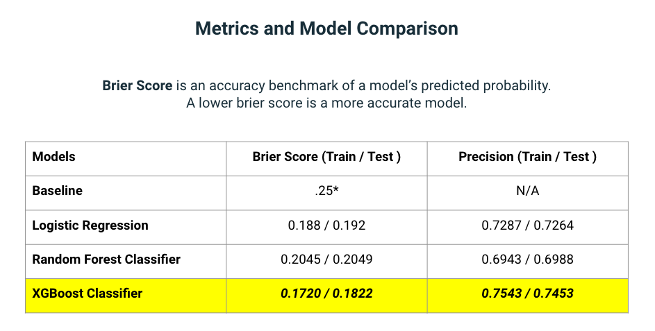

# **Project 5: Georgia State Recidivism: Binary Classification Forecasting**
## **DSI 1010 - Frank Novak, Preet Sekhon, Debbie Sim**
---

## Repo Folder Organization
|Folder|Type|Description|
|---|---|---|
|cleaned_data|folder|contains the cleaned datasets used for modeling |
|data|folder|contains raw datasets|
|pickles|folder|pickles of models ran during project| 
|plots|folder|exported graphs from jupyter lab as png files|
|01_Data-Cleaning-and-Pre-Processing|jupyter notebook|contains jupyter lab notebook with data cleaning & pre-procesing of datasets
|02_EDA-and-Data-Visualization|jupyter notebook|contains jupyter lab notebook with EDA and data visualization|
|03_Models_Conclusions|jupyter notebook|contains jupyter lab notebook modeling and conclusions|
|README-Project5.md|README|README file for project 5(group)|
|GADSI1010_Group-Project-5.pdf|pdf|pdf of presentation slides|
|data-dictionary.pdf|pdf|pdf of data dictionary for dataset|

## Data
- Main dataset was downloaded from the Office of Justice Programs website - [Source](https://data.ojp.usdoj.gov/Courts/NIJ-s-Recidivism-Challenge-Full-Dataset/ynf5-u8nk)
- Secondary supporting data was extracted from the United States Census Bureau data portal - [Source](https://data.census.gov/mdat/#/)

## Software
Jupyter Labs was used to house and run our Python notebooks. In addition, the following libraries were imported for use:
- Pandas
- NumPy
- scikit-Learn
- Math
- Pickle
- Skopt
- Xgboost
- Matplotlib
- Seaborn

## Problem Statement
The National Institute of Justice and the US Office of Justice Programs are looking to address recidivism rates by predicting persons most at risk. The focus of this project is to identify key variables that increase the probability a person will recidivate. Using a binary classification, can predictive attributes be identified and used to create solutions that can reduce prison reentry rates?

## Data Dictionary
Data dictionary can be found in the repository file named 'data-dictionary.pdf' and [here.](https://nij.ojp.gov/funding/recidivism-forecasting-challenge#g0jtto)

## Executive Summary
Recidivism is defined as a criminal act that results in rearrest, reconviction or return to prison with or without a new sentence during a three-year supervision period following the person's release. According to the National Institute of Justice, analytic and forecasting algorithms have been utilized to develop risk assessment tools to reduce recidivism. The focus of this project is to explore and build a binary classification model based on the recidivism data provided by the Office of Justice Programs. We hope to be able to identify attributes that are strong predictors of recidivism in order to provide suggestions for how to better support individuals into reintegrating back into society post incarceration. 

The data used for exploratory data anlysis and modeling was provided by the National Institute of Justice and Office of Justice Programs. The data includes information from the State of Georgia about persons released from prison to parole supervision for the period January 1, 2013, through December 31, 2015. In addition, we wrangled data from the US Census Bureau's data portal to bring in income-to-poverty data for Georgia's PUMAs regions. 

For this project, we chose to compare three models: LogisticRegression, RandomForest, XGBoost. During the modeling process, we utilized BayesSearchCV to fine tune the models for optimal parameters. The metric we chose to evaluate the models is the Brier score which is an accuracy metric of a model's predicted probability. A lower score is indicative of a better model. As a secondary metric, we evaluated the models on precision score to reduce false positives because the consequences of incorrectly being identified as high risk could lead to excession supervision. Please see below for findings, conclusions, and next steps.

## Background Information
**Office of Justice Programs - NIJ Recidivism Challenge** ([*source*](https://data.ojp.usdoj.gov/stories/s/daxx-hznc))
- The National Institute of Justice invests in scientific research across diverse disciplines to serve the needs of the criminal justice community.
- Many new data analytic methods could be further applied to the criminal justice system, specifically recidivism forecasting algorithms
- Since practitioners began to systematically assess risk, risk assessment tools have been constantly refined with new factors and types of data, including dynamic factors that capture current information regarding persons on probation and parole.
- Recidivism is measured as an arrest for a new felony or misdemeanor crime within three years of the supervision start date. 

## EDA Learnings ##
- During EDA, we discovered that recidivism is higher amongst individuals between the ages of 23-32 across all genders and races. The results of the logistic regression model showed that these two age groups, 23-27 and 18-22, were two of the top predictors of recidivism.  
- We explored % days employed and recidivism. Individuals who were employed at least ~61% of the supervision period are less likely to recidiviate within the 3 year period.
- The state of Georgia is split into 72 PUMAs regions identified by the US Census Bureau. The dataset grouped the 72 into 24 regions to identify attributes of any individuals. The average recidivism rate across all 24 regions is ~58%. There is a negative correlation between average income-to-poverty ratio and recidivism rate.
- Individuals that are gang affiliated are more likely to reoffend across all breakdowns including gender, race, and prison offense.

## Summary of Analysis
Overall, all models faired well with the data but XGBoost proved to have the best brier score overall. Logistic regression was used in order to show feature importance of the data. Below are the comparison of model scores:

## Conclusions & Potential Next Steps
- Employment & program attendances decrease odds of recidivism. Barriers to employment need to be addressed. Individuals need guaranteed employment opportunities rather than finding jobs independently.
- Increased support for young individuals between the ages of 18-27 is needed to decrease recidivism rates.
- Poverty is shown to factor into recidivism. Individuals need wrap-around support including, but not limited to stable income, housing, and mental health and substance abuse services
- In this dataset, PUMAs data are grouped together to hide identity. It may be better if PUMAs were analyzed on a more granular level for better geographic insights.
- As a follow-up to modeling, we are interested in comparing models split on race and gender to account for bias and help improve false positive rate. We would also test out additional models such as Neural Networks to improve predictive ability. 

## Sources
- "NIJ's Recidivism Challenge Full Dataset." Office of Justice Programs, U.S. Department of Justice, [Source](data.ojp.usdoj.gov/Courts/NIJ-s-Recidivism-Challenge-Full-Dataset/ynf5-u8nk)
- "Recidivism Forecasting Challenge." National Institute of Justice, U.S. Department of Justice, [Source](nij.ojp.gov/funding/recidivism-forecasting-challenge#g0jtto)
- "Evaluating Reentry Programs: A User's Guide to Measuring Recidivism." Office of Justice Programs, U.S. Department of Justice, [Source](www.ojp.gov/pdffiles1/nij/304110.pdf)
